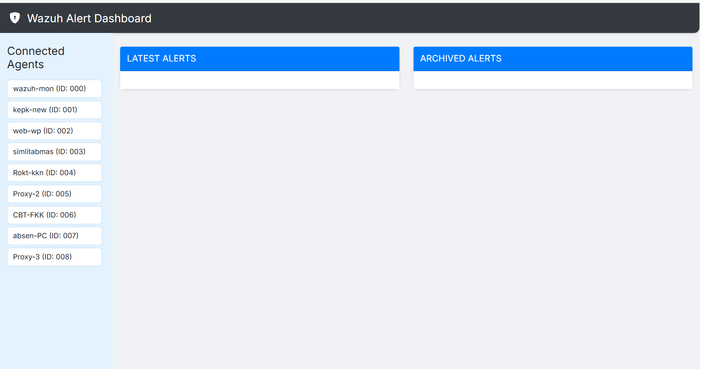

# 🛡️ Wazuh Alert Monitoring System


Web dashboard ringan dan real-time untuk memantau _alerts_ dari Wazuh melalui custom webhook.

## 📦 Fitur

- Menampilkan daftar agen Wazuh yang aktif.
- Menangkap alert dari webhook dan menampilkannya secara real-time via WebSocket.
- Visual alert dengan warna dan ikon berdasarkan level.
- Arsip otomatis untuk alert lama.
- Sidebar agen collapsible (terutama untuk layar kecil).
- Alarm suara untuk alert tinggi.
- Tampilan modern berbasis Bootstrap & Icons.

## 🚀 Instalasi & Jalankan

### 1. Clone Repository

```bash
git clone https://github.com/topobash/wazuh-alert-webhook.git
cd wazuh-alert-webhook
```

### 2. Jalankan Server

```bash
cd backend
npm install
node server.js
```

### 3. Akses Dashboard

Buka browser dan kunjungi:

```
http://<dashboard-ip>:3000
```

## 🗂️ Struktur Folder

```
frontend/
  ├── index.html
  ├── style.css
  ├── app.js
  └── sounds/
       └── alarm.wav
backend/
  └── server.js
```

## ⚙️ Konfigurasi

Edit `server.js` dan sesuaikan konfigurasi Wazuh:

```js
const WAZUH_API_URL = "https://your-wazuh-ip:55000";
const WAZUH_USER = "your-user";
const WAZUH_PASSWORD = "your-password";
```

## 📡 Integrasi dengan Wazuh Server

Untuk mengirim alert dari Wazuh ke dashboard ini, gunakan script `custom-webhook` dan `custom-webhook.py` yang berada pada foler `on-wazuh-server` dan letakan pada server Wazuh. Namun sebelumnya kamu edit file `custom-webhook.py` ubah bagian berikut dan sesuaikan dengan ip webhook server:

```bash

 # Kirim ke webhook
response = requests.post(
    "http://<ip-server-webhook>:3000/api/alerts",  # Ganti sesuai webhook kamu
    data=json.dumps(payload),
    headers={'Content-type': 'application/json'}
)

```

### 📁 Penempatan File

Tempatkan file `custom-webhook` dan `custom-webhook.py` ke dalam direktori:

```

/var/ossec/integrations/custom-webhook
/var/ossec/integrations/custom-webhook.py

```

### ⚙️ Konfigurasi `ossec.conf`

Tambahkan konfigurasi berikut di dalam `<integration>` block Wazuh:

```xml
<integration>
  <name>custom-webhook</name>
  <hook_url>local</hook_url>
  <level>5</level>
  <alert_format>json</alert_format>
</integration>
```

### ✅ Izin Eksekusi

Pastikan file dapat dieksekusi:

```bash
chmod +x /var/ossec/integrations/custom-webhook
```

### 🔁 Restart Wazuh Manager

```bash
systemctl restart wazuh-manager
```

Setiap alert akan dikirim ke endpoint:

```
http://<dashboard-ip>:3000/api/alerts
```

---

## 📷 Screenshot



## 📄 Lisensi

MIT License.

## 👨‍💻 Developer

Beliin kopi? boleh banget: [Buat Beli Kopi](https://saweria.co/topobasah)

    Developed with ❤️ by TopoBasah
    https://cobaterus.com
